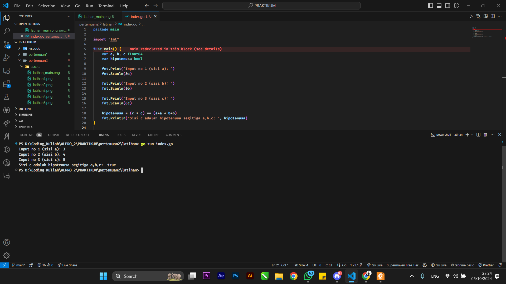
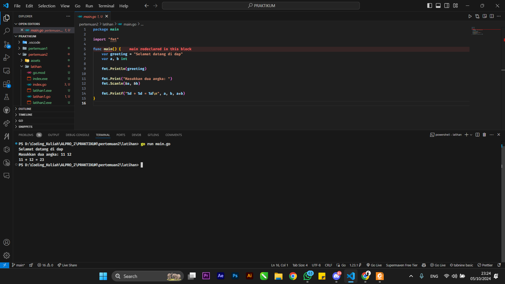
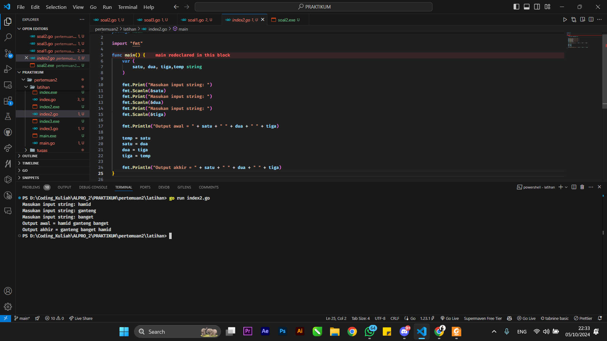
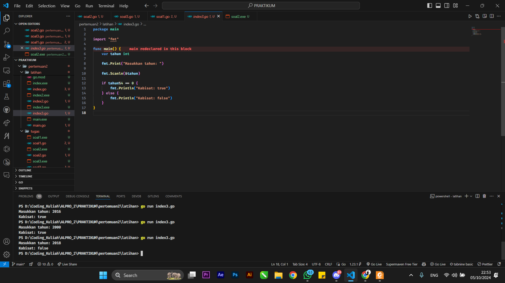
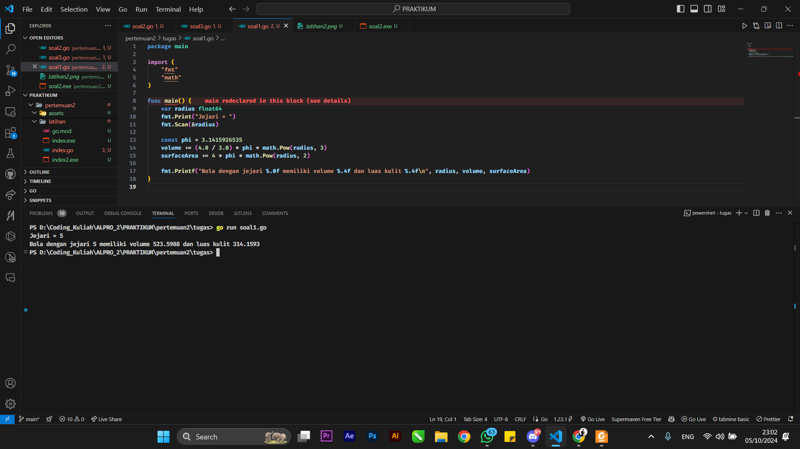
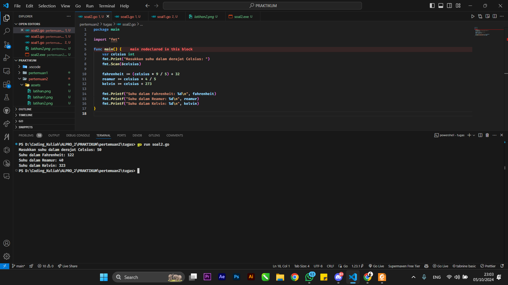
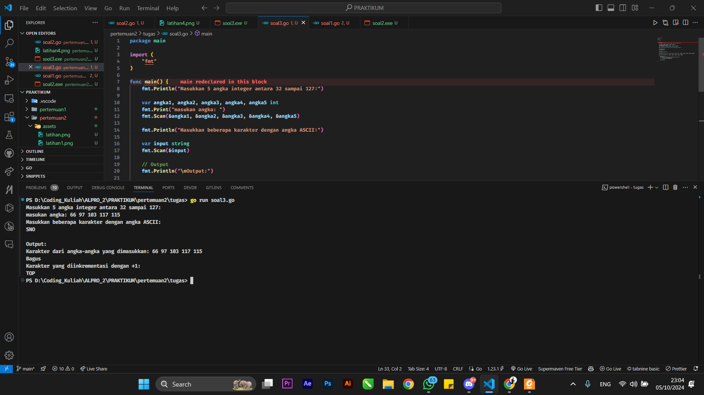

# <h1 align="center">Laporan Praktikum Modul 2 STRUKTUR KONTROL!</h1>


<h1 align="center">Hamid Sabirin-2311102129</h1>

<h2 align="center">PERTEMUAN 2</h2>
<h2 align="center">STRUKTUR KONTROL</h2>


### 1. Hipotenusa!

```go
package main

import "fmt"

func main() {
	var a, b, c float64
	var hipotenusa bool

	fmt.Print("Input no 1 (sisi a): ")
	fmt.Scanln(&a)

	fmt.Print("Input no 2 (sisi b): ")
	fmt.Scanln(&b)

	fmt.Print("Input no 3 (sisi c): ")
	fmt.Scanln(&c)

	hipotenusa = (c * c) == (a*a + b*b)
	fmt.Println("Sisi c adalah hipotenusa segitiga a,b,c: ", hipotenusa)
}
```

### Output Screenshot:



### 2. Gretting

```go
package main

import "fmt"

func main() {
	var greeting = "Selamat datang di dap"
	var a, b int

	fmt.Println(greeting)

	fmt.Print("Masukkan dua angka: ")
	fmt.Scanln(&a, &b)

	fmt.Printf("%d + %d = %d\n", a, b, a+b)
}

```

### Output Screenshot:




### 3. Latihan1 

```go
package main

import "fmt"

func main() {
	var (
		satu, dua, tiga,temp string
	)

	fmt.Print("Masukan input string: ")
	fmt.Scanln(&satu)
	fmt.Print("Masukan input string: ")
	fmt.Scanln(&dua)
	fmt.Print("Masukan input string: ")
	fmt.Scanln(&tiga)

	fmt.Println("Output awal = " + satu + " " + dua + " " + tiga)

	temp = satu
	satu = dua
	dua = tiga
	tiga = temp

	fmt.Println("Output akhir = " + satu + " " + dua + " " + tiga)
}
```

### Output Screenshot:



### 4. Latihan2

```go
package main

import "fmt"

func main() {
	var tahun int

	fmt.Print("Masukkan tahun: ")

	fmt.Scanln(&tahun)

	if tahun%4 == 0 {
		fmt.Println("Kabisat: true")
	} else {
		fmt.Println("Kabisat: false")
	}
}

```

### Output Screenshot:



### 5. Latihan3

```go
package main

import (
	"fmt"
	"math"
)

func main() {
	var radius float64
	fmt.Print("Jejari = ")
	fmt.Scan(&radius)

	const phi = 3.1415926535
	volume := (4.0 / 3.0) * phi * math.Pow(radius, 3)
	surfaceArea := 4 * phi * math.Pow(radius, 2)

	fmt.Printf("Bola dengan jejari %.0f memiliki volume %.4f dan luas kulit %.4f\n", radius, volume, surfaceArea)
}
```

### Output Screenshot:



### 6. Latihan4

```go
package main

import "fmt"

func main() {
	var celsius int
	fmt.Print("Masukkan suhu dalam derajat Celsius: ")
	fmt.Scan(&celsius)

	fahrenheit := (celsius * 9 / 5) + 32
	reamur := celsius * 4 / 5
	kelvin := celsius + 273

	fmt.Printf("Suhu dalam Fahrenheit: %d\n", fahrenheit)
	fmt.Printf("Suhu dalam Reamur: %d\n", reamur)
	fmt.Printf("Suhu dalam Kelvin: %d\n", kelvin)
}
```

### Output Screenshot:



### 6. Latihan5

```go
package main

import (
	"fmt"
)

func main() {
	fmt.Println("Masukkan 5 angka integer antara 32 sampai 127:")

	var angka1, angka2, angka3, angka4, angka5 int
	fmt.Print("masukan angka: ")
	fmt.Scan(&angka1, &angka2, &angka3, &angka4, &angka5)

	fmt.Println("Masukkan beberapa karakter dengan angka ASCII:")

	var input string
	fmt.Scan(&input)

	// Output
	fmt.Println("\nOutput:")

	fmt.Println("Karakter dari angka-angka yang dimasukkan:", angka1, angka2, angka3, angka4, angka5)

	fmt.Printf("%c%c%c%c%c\n", angka1, angka2, angka3, angka4, angka5)

	if len(input) > 0 {
		fmt.Println("Karakter yang diinkrementasi dengan +1:")
		for i := 0; i < len(input); i++ {
			fmt.Printf("%c", input[i]+1)
		}
		fmt.Println()
	}
}
```

### Output Screenshot:


