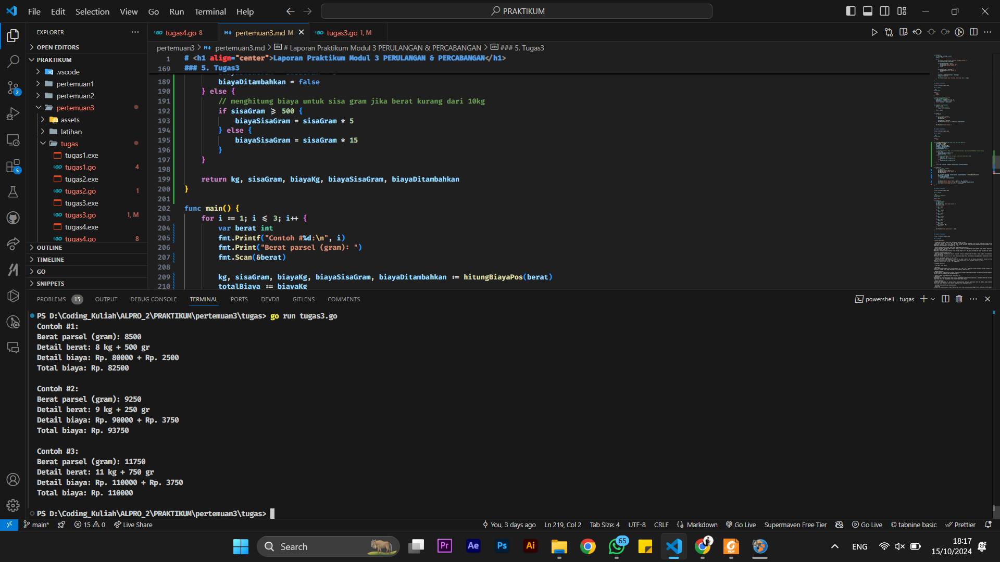
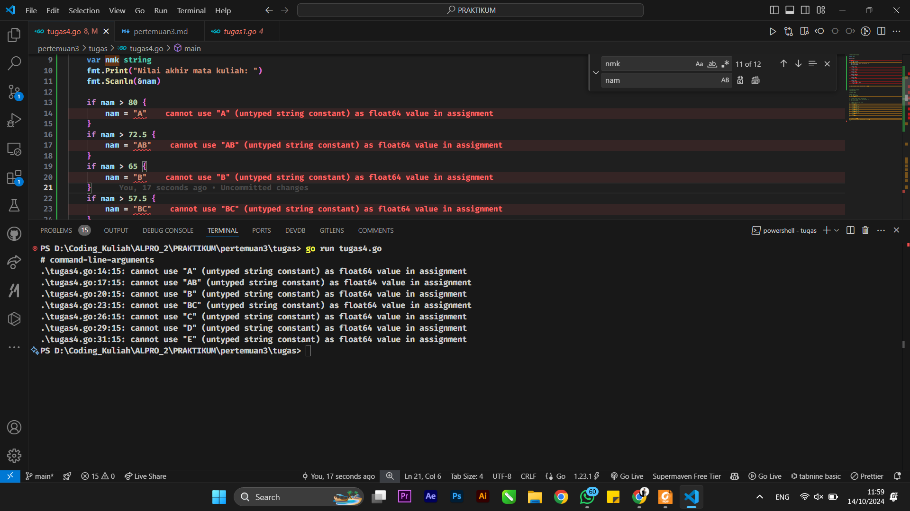

# <h1 align="center">Laporan Praktikum Modul 3 PERULANGAN & PERCABANGAN</h1>

<h1 align="center">Hamid Sabirin-2311102129</h1>

<h2 align="center">PERTEMUAN 3</h2>
<h2 align="center">PERULANGAN & PERCABANGAN</h2>

### 1. Latihan1

```go
package main

import "fmt"

func main() {
	urutanBenar := []string{"merah", "kuning", "hijau", "ungu"}
	hasil := true

	for i := 1; i <= 5; i++ {
		var warna1, warna2, warna3, warna4 string
		fmt.Printf("percobaan %d\n ", i)
		fmt.Print("masukkan warna pertama: ")
		fmt.Scan(&warna1)
		fmt.Print("masukkan warna kedua: ")
		fmt.Scan(&warna2)
		fmt.Print("masukkan warna ketiga: ")
		fmt.Scan(&warna3)
		fmt.Print("masukkan warna keempat: ")
		fmt.Scan(&warna4)

		if warna1 != urutanBenar[0] || warna2 != urutanBenar[1] || warna3 != urutanBenar[2] || warna4 != urutanBenar[3] {
			hasil = false
		}
	}
	println("BERHASIL", hasil)
}
```

### Output Screenshot:


### 2. Latihan2

```go
package main

import (
	"bufio"
	"fmt"
	"os"
	"strings"
)

func main() {
	scanner := bufio.NewScanner(os.Stdin)
	var pita string
	var bungaCount int

	for {
		fmt.Printf("bunga %d: ", bungaCount+1)
		scanner.Scan()
		input := scanner.Text()
		if strings.ToLower(input) == "selesai" {
			break
		}

		if pita == "" {
			pita = input
		} else {
			pita += "-" + input
		}
		bungaCount++
	}
	fmt.Printf("pita : %s\n", pita)
	fmt.Printf("bunga : %d\n", bungaCount)
}
```

### Output Screenshot:


### 3. Tugas1

```go
package main

import (
	"fmt"
	"math"
)

func main() {
	var kantong1, kantong2 float64
	oleng := false

	for {
		fmt.Print("Masukkan berat belanjaan di kedua kantong: ")
		fmt.Scan(&kantong1, &kantong2)

		if kantong1+kantong2 > 150 {
			fmt.Println("Berat melebihi 150")
			fmt.Println("Proses selesai.")
			break
		}

		if kantong1 < 0 || kantong2 < 0 {
			fmt.Println("Proses selesai.")
			break
		}

		selisih := math.Abs(kantong1 - kantong2)
		oleng = selisih > 9

		fmt.Printf("Sepeda motor Pak Andi akan oleng: %v\n", oleng)
	}
}
```

### Output Screenshot:


### 4. Tugas2

```go
package main

import (
	"fmt"
	"math"
)

// Fungsi untuk menghitung f(k)
func f(k float64) float64 {
	numerator := math.Pow((4*k + 2), 2)
	denominator := (4*k + 1) * (4*k + 3)
	return numerator / denominator
}

func sqrt2(k int) float64 {
	result := 1.0
	for i := 0; i <= k; i++ {
		result *= f(float64(i))
	}
	return result
}

func main() {
	var K int

	for i := 1; i <= 3; i++ {
		fmt.Print("Nilai K = ")
		fmt.Scan(&K)

		approxSqrt2 := sqrt2(K)
		fmt.Printf("Nilai akar 2 = %.10f\n\n", approxSqrt2)
	}

	fmt.Println("Proses selesai.")
}
```

### Output Screenshot:


### 5. Tugas3

```go
package main

import (
	"fmt"
)

func main() {
	for i := 1; i <= 3; i++ {
		var beratParsel, kg, gram int
		var biayaPerKg, biayaSisa, totalBiaya int

		// Input berat parsel dalam gram
		fmt.Printf("Contoh #%d:\n ", i)
		fmt.Print("Berat parsel (gram): ")
		fmt.Scan(&beratParsel)

		// berat dalam kg dan sisa gram
		kg = beratParsel / 1000
		gram = beratParsel % 1000

		//  biaya per kg 
		biayaPerKg = kg * 10000

		// biaya sisa berdasarkan gram
		if gram > 0 && kg < 10 {
			if gram <= 500 {
				biayaSisa = gram * 5
			} else {
				biayaSisa = gram * 15
			}
		} else {
			biayaSisa = 0 
		}

		// total biaya
		totalBiaya = biayaPerKg + biayaSisa

		// Output 
		fmt.Printf("Detail berat: %d kg + %d gram\n", kg, gram)
		fmt.Printf("Detail biaya: Rp. %d + Rp. %d\n", biayaPerKg, biayaSisa)
		fmt.Printf("Total biaya: Rp. %d\n\n", totalBiaya)
	}

	fmt.Println("Proses selesai.")
}
```

### Output Screenshot:



### 6. Tugas4a

```go
// Sebelum Di Perbaiki
package main

import "fmt"

func main() {
	var nam float64
	var nmk string

	fmt.Print("Nilai akhir mata kuliah: ")
	fmt.Scanln(&nam)

	if nam > 80 {
		nmk = "A"
	} else if nam > 72.5 {
		nmk = "AB"
	} else if nam > 65 {
		nmk = "B"
	} else if nam > 57.5 {
		nmk = "BC"
	} else if nam > 50 {
		nmk = "C"
	} else if nam > 40 {
		nmk = "D"
	} else {
		nmk = "E"
	}

	fmt.Println("Nilai mata kuliah: ", nmk)
}

```

### Output Screenshot:



### 6. Tugas4b

1. Kesalahan: Program tidak menggunakan else if pada beberapa kondisi, sehingga semua kondisi dievaluasi meskipun kondisi sebelumnya sudah terpenuhi.
    - Sebagai contoh, jika nam = 80.1, maka kondisi nam > 80 akan terpenuhi, namun kondisi lainnya juga akan diperiksa karena tidak ada else if pada kondisi selanjutnya.

2. Alur Program yang Seharusnya: Seharusnya, hanya satu kondisi yang akan dievaluasi untuk satu nilai nam. Misalnya, jika nam > 80 terpenuhi, maka program langsung memberikan nilai A dan mengabaikan kondisi lainnya. Oleh karena itu, struktur if-else if-else diperlukan agar hanya satu kondisi yang dievaluasi, meningkatkan efisiensi dan akurasi program.


### 7. Tugas4c

```go
// Sesudah Di Perbaiki
package main

import "fmt"

func main() {
	var nam float64
	var nmk string

	fmt.Print("Nilai akhir mata kuliah: ")
	fmt.Scanln(&nam)

	if nam > 80 {
		nmk = "A"
	} else if nam > 72.5 {
		nmk = "AB"
	} else if nam > 65 {
		nmk = "B"
	} else if nam > 57.5 {
		nmk = "BC"
	} else if nam > 50 {
		nmk = "C"
	} else if nam > 40 {
		nmk = "D"
	} else {
		nmk = "E"
	}

	fmt.Println("Nilai mata kuliah: ", nmk)
}
```

### Output Screenshot:


### 8. Tugas5

```go
package main

import "fmt"

func main() {
	for i := 1; i <= 2; i++ {
		var b int

		fmt.Printf("Bilangan ke-%d: ", i)
		fmt.Scan(&b)

		fmt.Print("Faktor: ")
		var jumlahFaktor int
		for j := 1; j <= b; j++ {
			if b%j == 0 {
				fmt.Printf("%d ", j)
				jumlahFaktor++
			}
		}
		fmt.Println()

		isPrima := jumlahFaktor == 2

		fmt.Printf("Prima: %t\n\n", isPrima)
	}

	fmt.Println("Proses selesai.")
}
```

### Output Screenshot:


