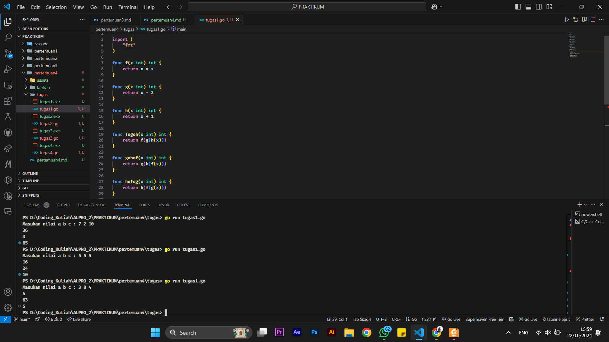

# <h1 align="center">Laporan Praktikum Modul 4 FUNGSI & PROSEDUR</h1>

<h1 align="center">Hamid Sabirin-2311102129</h1>

<h2 align="center">PERTEMUAN 4</h2>
<h2 align="center">FUNGSI & PROSEDUR</h2> 

### 1. Latihan1

```go
package main

import "fmt"

func faktorial(n int) int {
	var hasil int = 1
	var i int
	for i = 1; i <= n; i++ {
		hasil = hasil * i
	}
	return hasil
}

func permutasi(n, r int) int {
	return faktorial(n) / faktorial(n-r)
}

func main() {
	var a, b int
	fmt.Scan(&a, &b)
	if a >= b {
		fmt.Println(permutasi(a, b))
	} else {
		fmt.Println(permutasi(b, a))
	}
}

```

### Output Screenshot:


### 2. Latihan2

```go
package main

import "fmt"

func faktorial(n int) int {
	if n == 0 || n == 1 {
		return 1
	}
	result := 1
	for i := 2; i <= n; i++ {
		result *= i
	}
	return result
}

func permutasi(n, r int) int {
	return faktorial(n) / faktorial(n-r)
}

func kombinasi(n, r int) int {
	return faktorial(n) / (faktorial(r) * faktorial(n-r))
}

func main() {
	var a, b, c, d int

	fmt.Println("Masukkan nilai a b c d :")
	fmt.Scan(&a, &b, &c, &d)

	p1 := permutasi(a, c)
	c1 := kombinasi(a, c)

	p2 := permutasi(b, d)
	c2 := kombinasi(b, d)

	fmt.Printf("P(%d, %d) = %d\n", a, c, p1)
	fmt.Printf("C(%d, %d) = %d\n", a, c, c1)
	fmt.Printf("P(%d, %d) = %d\n", b, d, p2)
	fmt.Printf("C(%d, %d) = %d\n", b, d, c2)
}
```

### Output Screenshot:


### 3. Latihan3

```go
package main

import "fmt"

//fungsi rekursif untuk deret fibonancci
func fibonanci(n int) int {
	if n == 0 {
		return 0
	} else if n == 1 {
		return 1
	} else {
		return fibonanci(n-1) + fibonanci(n-2)
	}
}

func main() {
	// output deret fibonanci hingga suku ke 1
	fmt.Println("Deret fibonanci hingga suku ke 10 :")
	for i := 0; i <= 10; i++ {
		fmt.Printf("fibonanci(%d)=%d\n", i, fibonanci(i))
	}
}
```

### Output Screenshot:


### 4. Tugas1

```go
package main

import (
	"fmt"
)

func f(x int) int {
	return x * x
}

func g(x int) int {
	return x - 2
}

func h(x int) int {
	return x + 1
}

func fogoh(x int) int {
	return f(g(h(x)))
}

func gohof(x int) int {
	return g(h(f(x)))
}

func hofog(x int) int {
	return h(f(g(x)))
}

func main() {
	var a, b, c int
	fmt.Print("Masukan nilai a b c : ")
	fmt.Scanf("%d %d %d", &a, &b, &c)

	fmt.Println(fogoh(a))
	fmt.Println(gohof(b))
	fmt.Println(hofog(c))

}
```

### Output Screenshot:



### 5. Tugas2

```go
package main

import (
	"fmt"
	"math"
)

// menghitung jarak antara dua titik
func hitungJarak(p1x, p1y, p2x, p2y float64) float64 {
	return math.Sqrt(math.Pow(p2x-p1x, 2) + math.Pow(p2y-p1y, 2))
}

// menentukan apakah titik berada di dalam lingkaran
func cekDalamLingkaran(tx, ty, lcx, lcy, radius float64) bool {
	return hitungJarak(tx, ty, lcx, lcy) <= radius
}

func main() {
	var pusat1x, pusat1y, jariJari1 float64
	var pusat2x, pusat2y, jariJari2 float64
	var titikX, titikY float64

	fmt.Scan(&pusat1x, &pusat1y, &jariJari1)
	fmt.Scan(&pusat2x, &pusat2y, &jariJari2)
	fmt.Scan(&titikX, &titikY)

	// Mengecek posisi titik terhadap lingkaran 1 dan 2
	diLingkaran1 := cekDalamLingkaran(titikX, titikY, pusat1x, pusat1y, jariJari1)
	diLingkaran2 := cekDalamLingkaran(titikX, titikY, pusat2x, pusat2y, jariJari2)

	// Menentukan output berdasarkan posisi titik
	if diLingkaran1 && diLingkaran2 {
		fmt.Println("Titik berada di dalam lingkaran 1 dan 2")
	} else if diLingkaran1 {
		fmt.Println("Titik berada di dalam lingkaran 1")
	} else if diLingkaran2 {
		fmt.Println("Titik berada di dalam lingkaran 2")
	} else {
		fmt.Println("Titik berada di luar lingkaran 1 dan 2")
	}
}
```

### Output Screenshot:


### 6. Tugas3

```go
package main

import (
	"bufio"
	"fmt"
	"os"
	"strings"
)

//  untuk menghitung total soal yang diselesaikan dan total skor
func hitungSkor(input string) (int, int) {
	parts := strings.Fields(input)
	waktuPengerjaan := parts[1:] 
	totalSoal := 0
	totalWaktu := 0

	// Iterasi waktu pengerjaan untuk setiap soal
	for _, waktu := range waktuPengerjaan {
		var waktuInt int
		fmt.Sscanf(waktu, "%d", &waktuInt)

		if waktuInt <= 300 {
			totalSoal++
			totalWaktu += waktuInt
		}
	}
	return totalSoal, totalWaktu
}

func main() {
	scanner := bufio.NewScanner(os.Stdin)
	var pemenang string
	var maxSoal, minWaktu int
	minWaktu = 1000000

	for {
		// Input dari user
		fmt.Println("Masukkan data peserta (nama dan waktu pengerjaan), atau ketik 'Selesai' untuk menghentikan input:")
		scanner.Scan()
		input := scanner.Text()

		// Cek jika user sudah selesai memasukkan data
		if strings.ToLower(input) == "selesai" {
			break
		}

		// Hitung skor berdasarkan input peserta
		soal, waktu := hitungSkor(input)

		// Tampilkan hasil untuk peserta yang sedang diinput
		fmt.Println("Nama:", strings.Fields(input)[0], "Soal diselesaikan:", soal, "Total waktu:", waktu)

		
		// jika soal yang diselesaikan sama, yang memiliki waktu lebih sedikit yang menang
		if soal > maxSoal || (soal == maxSoal && waktu < minWaktu) {
			pemenang = strings.Fields(input)[0]
			maxSoal = soal
			minWaktu = waktu
		}
	}

	// Cetak pemenang setelah semua data dimasukkan
	if pemenang != "" {
		fmt.Printf("Pemenang: %s %d soal, total waktu: %d menit\n", pemenang, maxSoal, minWaktu)
	} else {
		fmt.Println("Tidak ada peserta yang valid.")
	}
}
```

### Output Screenshot:


### 7. Tugas4

```go
package main

import (
	"fmt"
)

// Fungsi cetakDeret untuk mencetak deret sesuai aturan yang diberikan
func cetakDeret(n int) {
	for n != 1 {
		fmt.Print(n, " ")

		if n%2 == 0 {
			n = n / 2
		} else {
			n = 3*n + 1
		}
	}
	fmt.Println(1)
}

func main() {
	var n int

	// input dari pengguna
	fmt.Print("Masukkan angka: ")
	fmt.Scanln(&n)

	// memastikan bahwa input valid (kurang dari 1 juta)
	if n <= 0 || n >= 1000000 {
		fmt.Println("Input harus bilangan positif dan kurang dari 1 juta!")
		return
	}
	cetakDeret(n)
}
```

### Output Screenshot:

