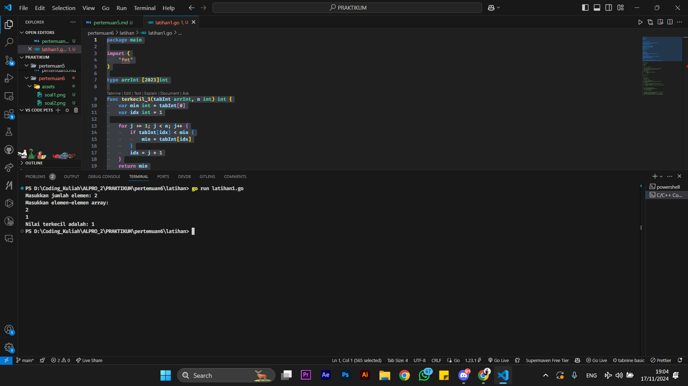
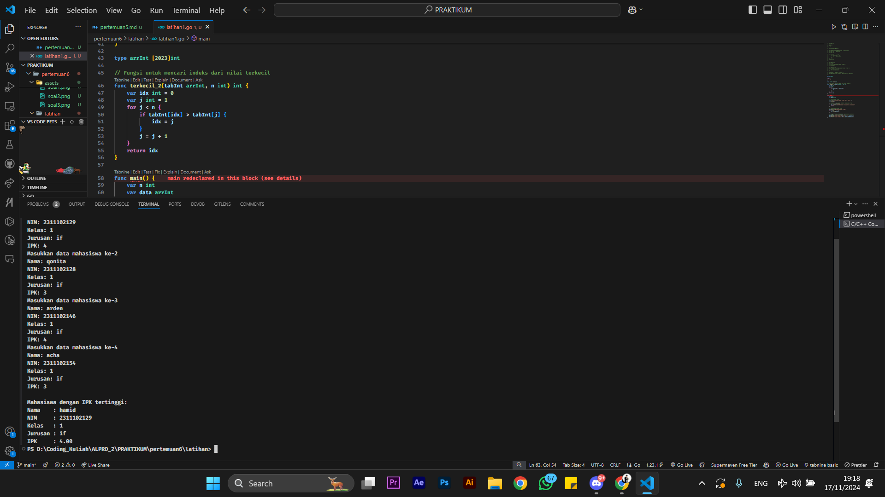
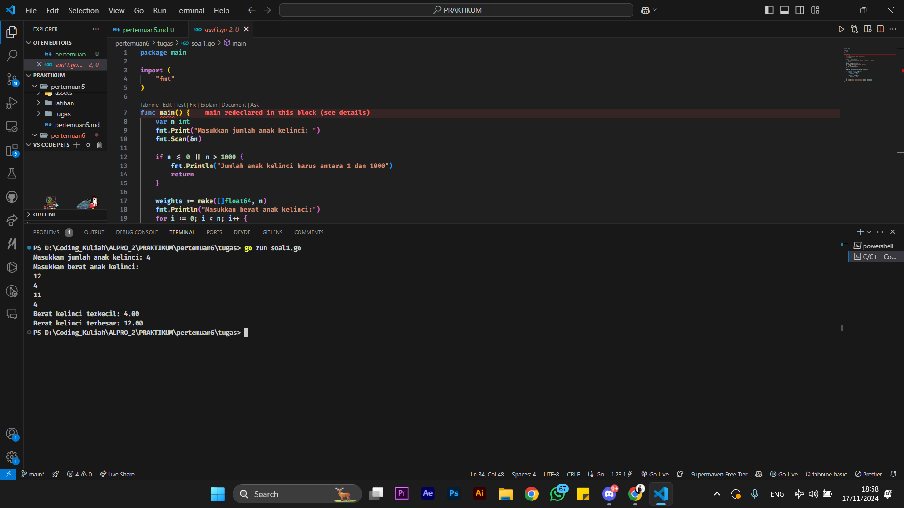
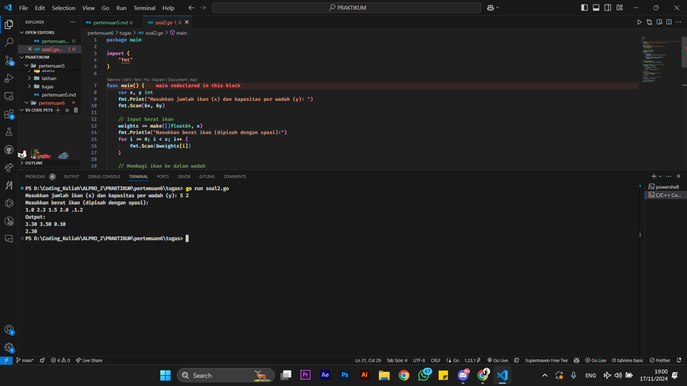
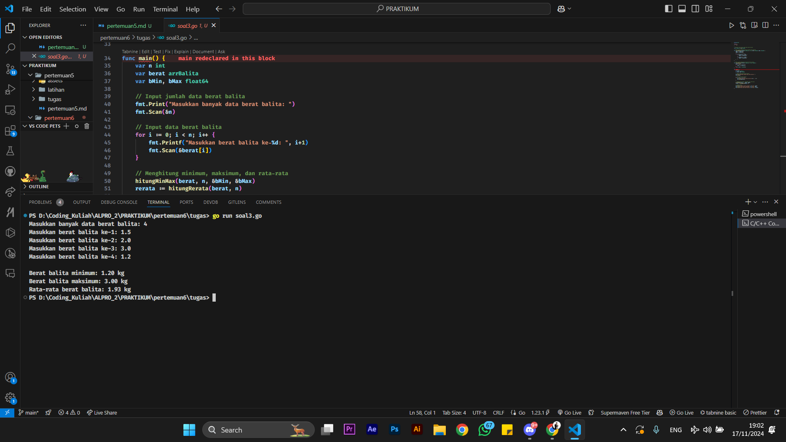

# <h1 align="center">Laporan Praktikum Modul 6 PENCARIAN NILAI ESKTRIM PADA HIMPUNAN DATA</h1>

<h1 align="center">Hamid Sabirin-2311102129</h1>

<h2 align="center">PERTEMUAN 6</h2>
<h2 align="center">PENCARIAN NILAI ESKTRIM PADA HIMPUNAN DATA</h2> 

### 1. Latihan1

```go

// SESI 1
package main

import (
	"fmt"
)

type arrInt [2023]int

func terkecil_1(tabInt arrInt, n int) int {
	var min int = tabInt[0]
	var idx int = 1

	for j := 1; j < n; j++ {
		if tabInt[idx] < min {
			min = tabInt[idx]
		}
		idx = j + 1
	}
	return min
}

func main() {
	var n int
	fmt.Print("Masukkan jumlah elemen: ")
	fmt.Scan(&n)

	var data arrInt
	fmt.Println("Masukkan elemen-elemen array:")
	for i := 0; i < n; i++ {
		fmt.Scan(&data[i])
	}

	smallest := terkecil_1(data, n)
	fmt.Printf("Nilai terkecil adalah: %d\n", smallest)
}

// SESI 2
package main

import (
	"fmt"
)

type arrInt [2023]int

// Fungsi untuk mencari indeks dari nilai terkecil
func terkecil_2(tabInt arrInt, n int) int {
	var idx int = 0
	var j int = 1
	for j < n {
		if tabInt[idx] > tabInt[j] {
			idx = j
		}
		j = j + 1
	}
	return idx
}

func main() {
	var n int
	var data arrInt

	// Input jumlah elemen N
	fmt.Print("Masukkan jumlah elemen (N <= 2023): ")
	fmt.Scan(&n)

	// Validasi N agar tidak melebihi kapasitas array
	if n <= 0 || n > 2023 {
		fmt.Println("Jumlah elemen harus antara 1 dan 2023")
		return
	}

	// Input elemen-elemen array
	fmt.Println("Masukkan elemen array:")
	for i := 0; i < n; i++ {
		fmt.Scan(&data[i])
	}

	// Panggil fungsi untuk mencari indeks nilai terkecil
	idxTerkecil := terkecil_2(data, n)
	fmt.Printf("Indeks nilai terkecil: %d\n", idxTerkecil)
	fmt.Printf("Nilai terkecil: %d\n", data[idxTerkecil])
}
```

### Output Screenshot:




### 2. Latihan2

```go
package main

import (
	"fmt"
)

// Mendefinisikan tipe data mahasiswa
type mahasiswa struct {
	nama, nim, kelas, jurusan string
	ipk                       float64
}

// Mendefinisikan array mahasiswa dengan kapasitas 2023
type arrMhs [2023]mahasiswa

// Fungsi untuk mencari indeks mahasiswa dengan IPK tertinggi
func IPK_2(T arrMhs, n int) int {
	// idx menyimpan indeks mahasiswa dengan IPK tertinggi sementara
	var idx int = 0
	var j int = 1
	for j < n {
		if T[idx].ipk < T[j].ipk {
			idx = j
		}
		j = j + 1
	}
	return idx
}

func main() {
	var n int
	var data arrMhs

	// Input jumlah mahasiswa
	fmt.Print("Masukkan jumlah mahasiswa (N <= 2023): ")
	fmt.Scan(&n)

	// Validasi jumlah mahasiswa
	if n <= 0 || n > 2023 {
		fmt.Println("Jumlah mahasiswa harus antara 1 dan 2023")
		return
	}

	// Input data mahasiswa
	for i := 0; i < n; i++ {
		fmt.Printf("Masukkan data mahasiswa ke-%d\n", i+1)
		fmt.Print("Nama: ")
		fmt.Scan(&data[i].nama)
		fmt.Print("NIM: ")
		fmt.Scan(&data[i].nim)
		fmt.Print("Kelas: ")
		fmt.Scan(&data[i].kelas)
		fmt.Print("Jurusan: ")
		fmt.Scan(&data[i].jurusan)
		fmt.Print("IPK: ")
		fmt.Scan(&data[i].ipk)
	}

	// Panggil fungsi untuk mencari indeks mahasiswa dengan IPK tertinggi
	idxTertinggi := IPK_2(data, n)

	// Tampilkan data mahasiswa dengan IPK tertinggi
	fmt.Println("\nMahasiswa dengan IPK tertinggi:")
	fmt.Printf("Nama    : %s\n", data[idxTertinggi].nama)
	fmt.Printf("NIM     : %s\n", data[idxTertinggi].nim)
	fmt.Printf("Kelas   : %s\n", data[idxTertinggi].kelas)
	fmt.Printf("Jurusan : %s\n", data[idxTertinggi].jurusan)
	fmt.Printf("IPK     : %.2f\n", data[idxTertinggi].ipk)
}
```

### Output Screenshot:



### 1. Tugas1

```go
package main

import (
    "fmt"
)

func main() {
    var n int
    fmt.Print("Masukkan jumlah anak kelinci: ")
    fmt.Scan(&n)

    if n <= 0 || n > 1000 {
        fmt.Println("Jumlah anak kelinci harus antara 1 dan 1000")
        return
    }

    weights := make([]float64, n)
    fmt.Println("Masukkan berat anak kelinci:")
    for i := 0; i < n; i++ {
        fmt.Scan(&weights[i])
    }

    minWeight, maxWeight := weights[0], weights[0]

    for _, weight := range weights[1:] {
        if weight < minWeight {
            minWeight = weight
        }
        if weight > maxWeight {
            maxWeight = weight
        }
    }

    fmt.Printf("Berat kelinci terkecil: %.2f\n", minWeight)
    fmt.Printf("Berat kelinci terbesar: %.2f\n", maxWeight)
}
```

### Output Screenshot:



### 2. Tugas2

```go
package main

import (
	"fmt"
)

func main() {
	var jumlahIkan, kapasitasWadah int
	fmt.Print("Masukkan jumlah ikan (x) dan kapasitas per wadah (y): ")
	fmt.Scan(&jumlahIkan, &kapasitasWadah)

	// Input berat ikan
	beratIkan := make([]float64, jumlahIkan)
	fmt.Println("Masukkan berat ikan (dipisah dengan spasi):")
	for i := 0; i < jumlahIkan; i++ {
		fmt.Scan(&beratIkan[i])
	}

	// Membagi ikan ke dalam wadah
	wadah := [][]float64{}
	wadahSaatIni := []float64{}
	jumlahDalamWadah := 0

	for i := 0; i < jumlahIkan; i++ {
		if jumlahDalamWadah < kapasitasWadah {
			wadahSaatIni = append(wadahSaatIni, beratIkan[i])
			jumlahDalamWadah++
		} else {
			wadah = append(wadah, wadahSaatIni)
			wadahSaatIni = []float64{beratIkan[i]}
			jumlahDalamWadah = 1
		}
	}
	// Menambahkan wadah terakhir
	if len(wadahSaatIni) > 0 {
		wadah = append(wadah, wadahSaatIni)
	}

	// Menghitung total berat dan rata-rata berat setiap wadah
	totalBeratPerWadah := []float64{}
	for _, satuWadah := range wadah {
		jumlahBerat := 0.0
		for _, berat := range satuWadah {
			jumlahBerat += berat
		}
		totalBeratPerWadah = append(totalBeratPerWadah, jumlahBerat)
	}

	// Output hasil
	fmt.Println("Output:")
	// Baris pertama: Total berat ikan di setiap wadah
	for _, total := range totalBeratPerWadah {
		fmt.Printf("%.2f ", total)
	}
	fmt.Println()

	// Baris kedua: Rata-rata berat ikan di setiap wadah
	rataRata := 0.0
	for _, total := range totalBeratPerWadah {
		rataRata += total
	}
	rataRata /= float64(len(totalBeratPerWadah))
	fmt.Printf("%.2f\n", rataRata)
}
```

### Output Screenshot:



### 9. Tugas3 

```go
package main

import (
	"fmt"
)

// Definisi tipe array untuk data berat balita
type arrBalita [100]float64

// Fungsi untuk menghitung berat minimum dan maksimum
func hitungMinMax(arrBerat arrBalita, n int, bMin *float64, bMax *float64) {
	*bMin = arrBerat[0]
	*bMax = arrBerat[0]

	for i := 1; i < n; i++ {
		if arrBerat[i] < *bMin {
			*bMin = arrBerat[i]
		}
		if arrBerat[i] > *bMax {
			*bMax = arrBerat[i]
		}
	}
}

// Fungsi untuk menghitung rata-rata berat balita
func hitungRerata(arrBerat arrBalita, n int) float64 {
	total := 0.0
	for i := 0; i < n; i++ {
		total += arrBerat[i]
	}
	return total / float64(n)
}

func main() {
	var n int
	var berat arrBalita
	var bMin, bMax float64

	// Input jumlah data berat balita
	fmt.Print("Masukkan banyak data berat balita: ")
	fmt.Scan(&n)

	// Input data berat balita
	for i := 0; i < n; i++ {
		fmt.Printf("Masukkan berat balita ke-%d: ", i+1)
		fmt.Scan(&berat[i])
	}

	// Menghitung minimum, maksimum, dan rata-rata
	hitungMinMax(berat, n, &bMin, &bMax)
	rerata := hitungRerata(berat, n)

	// Output hasil
	fmt.Printf("\nBerat balita minimum: %.2f kg\n", bMin)
	fmt.Printf("Berat balita maksimum: %.2f kg\n", bMax)
	fmt.Printf("Rata-rata berat balita: %.2f kg\n", rerata)
}
```

### Output Screenshot:

