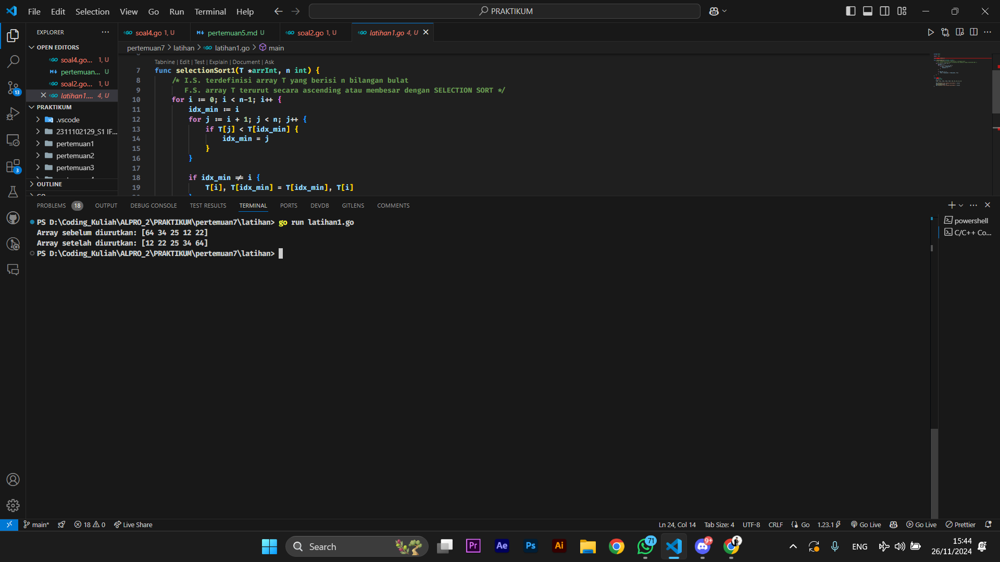
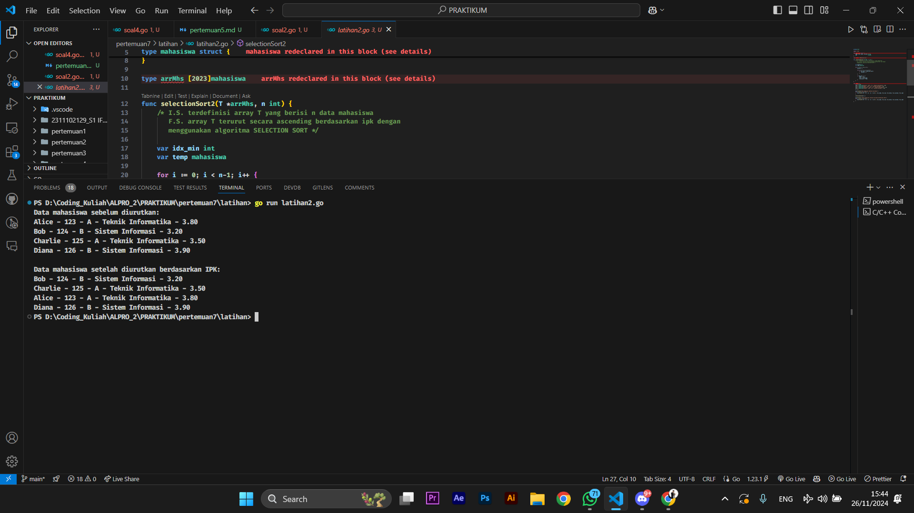
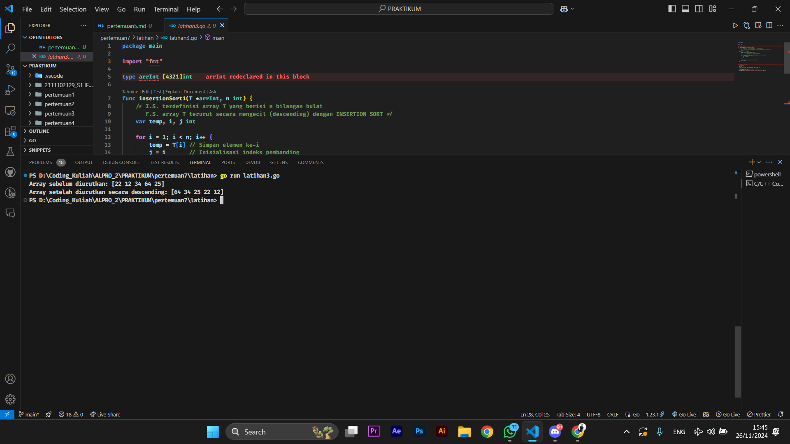
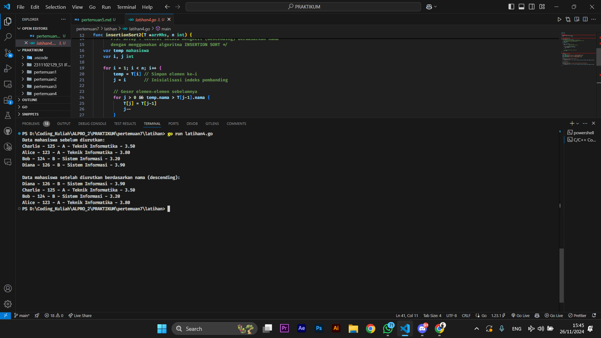
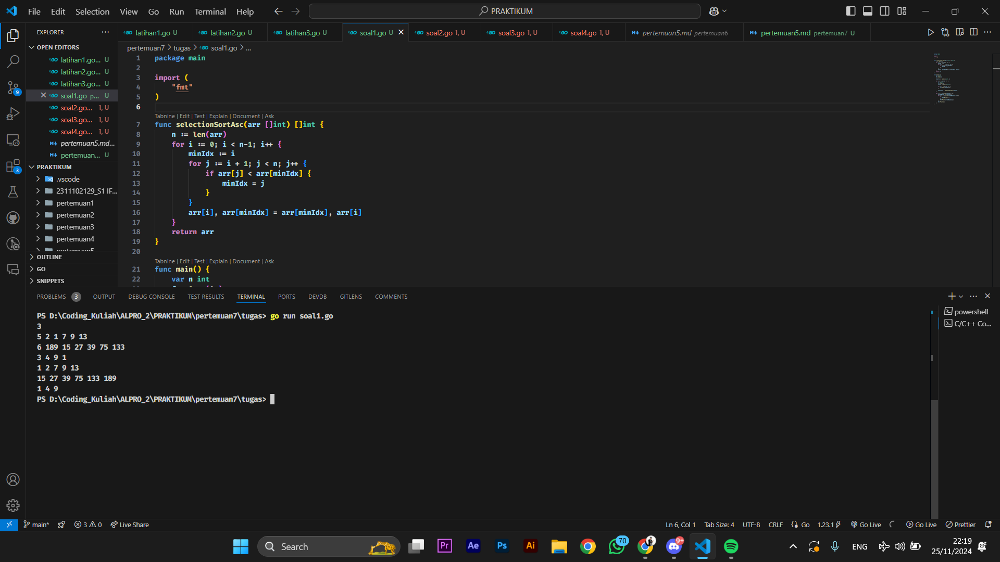
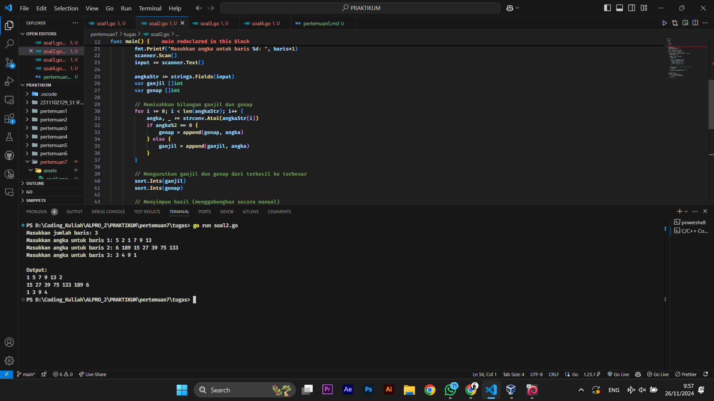
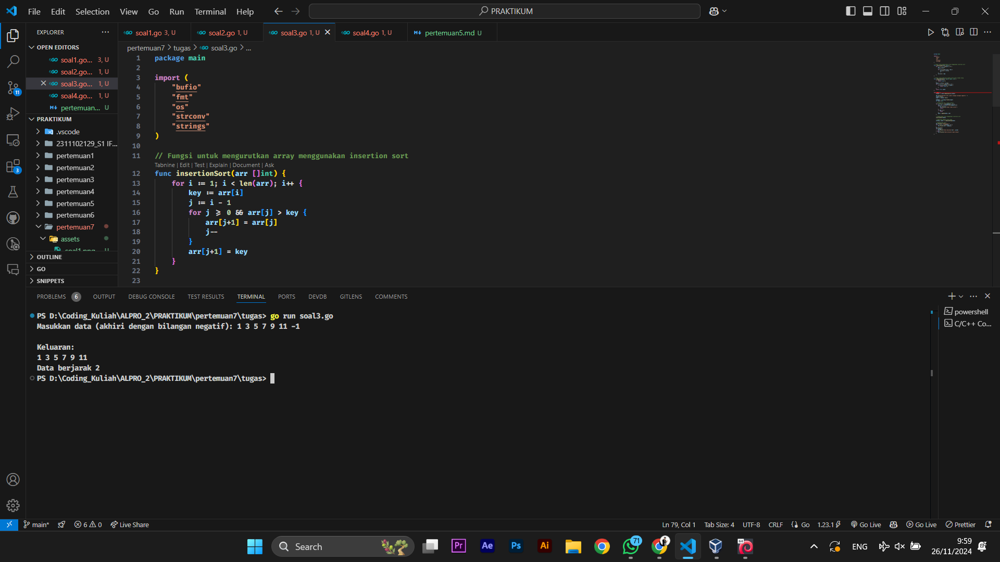
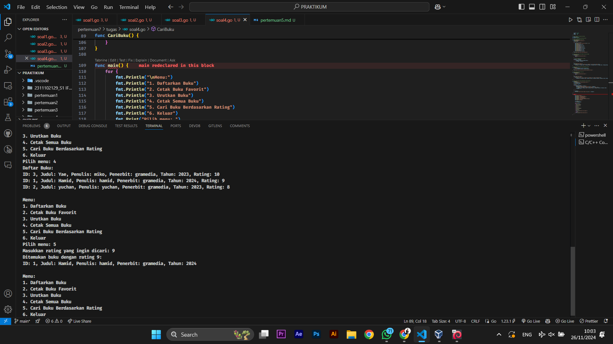

# <h1 align="center">Laporan Praktikum Modul 7 PENGURUTAN DATA</h1>

<h1 align="center">Hamid Sabirin-2311102129</h1>

<h2 align="center">PERTEMUAN 7</h2>
<h2 align="center">PENGURUTAN DATA</h2> 

### 1. Latihan1

```go
package main

import "fmt"

type arrInt [4321]int

func selectionSort1(T *arrInt, n int) {
	/* I.S. terdefinisi array T yang berisi n bilangan bulat
	   F.S. array T terurut secara ascending atau membesar dengan SELECTION SORT */
	for i := 0; i < n-1; i++ {
		idx_min := i
		for j := i + 1; j < n; j++ {
			if T[j] < T[idx_min] {
				idx_min = j
			}
		}

		if idx_min != i {
			T[i], T[idx_min] = T[idx_min], T[i]
		}
	}
}

func main() {
	var T arrInt
	n := 5
	T[0], T[1], T[2], T[3], T[4] = 64, 34, 25, 12, 22

	fmt.Println("Array sebelum diurutkan:", T[:n])
	selectionSort1(&T, n)
	fmt.Println("Array setelah diurutkan:", T[:n])
}
```

### Output Screenshot:



### 2. Latihan2

```go
package main

import "fmt"

type mahasiswa struct {
	nama, nim, kelas, jurusan string
	ipk                       float64
}

type arrMhs [2023]mahasiswa

func selectionSort2(T *arrMhs, n int) {
	/* I.S. terdefinisi array T yang berisi n data mahasiswa
	   F.S. array T terurut secara ascending berdasarkan ipk dengan
	   menggunakan algoritma SELECTION SORT */

	var idx_min int
	var temp mahasiswa

	for i := 0; i < n-1; i++ {
		idx_min = i

		for j := i + 1; j < n; j++ {
			if T[j].ipk < T[idx_min].ipk {
				idx_min = j
			}
		}

		if idx_min != i {
			temp = T[i]
			T[i] = T[idx_min]
			T[idx_min] = temp
		}
	}
}

func main() {
	var T arrMhs
	T[0] = mahasiswa{"Alice", "123", "A", "Teknik Informatika", 3.8}
	T[1] = mahasiswa{"Bob", "124", "B", "Sistem Informasi", 3.2}
	T[2] = mahasiswa{"Charlie", "125", "A", "Teknik Informatika", 3.5}
	T[3] = mahasiswa{"Diana", "126", "B", "Sistem Informasi", 3.9}
	n := 4

	fmt.Println("Data mahasiswa sebelum diurutkan:")
	for i := 0; i < n; i++ {
		fmt.Printf("%s - %s - %s - %s - %.2f\n", T[i].nama, T[i].nim, T[i].kelas, T[i].jurusan, T[i].ipk)
	}

	selectionSort2(&T, n)

	fmt.Println("\nData mahasiswa setelah diurutkan berdasarkan IPK:")
	for i := 0; i < n; i++ {
		fmt.Printf("%s - %s - %s - %s - %.2f\n", T[i].nama, T[i].nim, T[i].kelas, T[i].jurusan, T[i].ipk)
	}
}
```

### Output Screenshot:



### 3. Latihan3

```go
package main

import "fmt"

type arrInt [4321]int

func insertionSort1(T *arrInt, n int) {
	/* I.S. terdefinisi array T yang berisi n bilangan bulat
	   F.S. array T terurut secara mengecil (descending) dengan INSERTION SORT */
	var temp, i, j int

	for i = 1; i < n; i++ {
		temp = T[i] // Simpan elemen ke-i
		j = i       // Inisialisasi indeks pembanding

		// Geser elemen-elemen sebelumnya yang lebih kecil dari temp
		for j > 0 && temp > T[j-1] {
			T[j] = T[j-1]
			j--
		}

		// Tempatkan temp pada posisi yang sesuai
		T[j] = temp
	}
}

func main() {
	// Contoh penggunaan
	var T arrInt
	n := 5
	T[0], T[1], T[2], T[3], T[4] = 22, 12, 34, 64, 25

	fmt.Println("Array sebelum diurutkan:", T[:n])
	insertionSort1(&T, n)
	fmt.Println("Array setelah diurutkan secara descending:", T[:n])
}
```

### Output Screenshot:




### 4. Latihan4

```go
package main

import "fmt"

type mahasiswa struct {
	nama, nim, kelas, jurusan string
	ipk                       float64
}

type arrMhs [2023]mahasiswa

func insertionSort2(T *arrMhs, n int) {
	/* I.S. terdefinisi array T yang berisi n data mahasiswa
	   F.S. array T terurut secara mengecil (descending) berdasarkan nama
	   dengan menggunakan algoritma INSERTION SORT */
	var temp mahasiswa
	var i, j int

	for i = 1; i < n; i++ {
		temp = T[i] // Simpan elemen ke-i
		j = i       // Inisialisasi indeks pembanding

		// Geser elemen-elemen sebelumnya
		for j > 0 && temp.nama > T[j-1].nama {
			T[j] = T[j-1]
			j--
		}

		// Tempatkan temp pada posisi yang sesuai
		T[j] = temp
	}
}

func main() {
	// Contoh data mahasiswa
	var T arrMhs
	T[0] = mahasiswa{"Charlie", "125", "A", "Teknik Informatika", 3.5}
	T[1] = mahasiswa{"Alice", "123", "A", "Teknik Informatika", 3.8}
	T[2] = mahasiswa{"Bob", "124", "B", "Sistem Informasi", 3.2}
	T[3] = mahasiswa{"Diana", "126", "B", "Sistem Informasi", 3.9}
	n := 4

	fmt.Println("Data mahasiswa sebelum diurutkan:")
	for i := 0; i < n; i++ {
		fmt.Printf("%s - %s - %s - %s - %.2f\n", T[i].nama, T[i].nim, T[i].kelas, T[i].jurusan, T[i].ipk)
	}

	insertionSort2(&T, n)

	fmt.Println("\nData mahasiswa setelah diurutkan berdasarkan nama (descending):")
	for i := 0; i < n; i++ {
		fmt.Printf("%s - %s - %s - %s - %.2f\n", T[i].nama, T[i].nim, T[i].kelas, T[i].jurusan, T[i].ipk)
	}
}
```

### Output Screenshot:




### 1. Tugas1

```go
package main

import (
	"fmt"
)

func selectionSortAsc(arr []int) []int {
	n := len(arr)
	for i := 0; i < n-1; i++ {
		minIdx := i
		for j := i + 1; j < n; j++ {
			if arr[j] < arr[minIdx] {
				minIdx = j
			}
		}
		arr[i], arr[minIdx] = arr[minIdx], arr[i]
	}
	return arr
}

func main() {
	var n int
	fmt.Scan(&n)

	results := make([][]int, n)

	for i := 0; i < n; i++ {
		var m int
		fmt.Scan(&m)
		houses := make([]int, m)

		for j := 0; j < m; j++ {
			fmt.Scan(&houses[j])
		}

		results[i] = selectionSortAsc(houses)
	}

	for i := 0; i < len(results); i++ {
		sortedHouses := results[i]
		for j := 0; j < len(sortedHouses); j++ {
			if j > 0 {
				fmt.Print(" ")
			}
			fmt.Print(sortedHouses[j])
		}
		fmt.Println()
	}
}
```

### Output Screenshot:



### 2. Tugas2

```go
package main

import (
	"bufio"
	"fmt"
	"os"
	"strconv"
	"strings"
)

// Fungsi selection sort untuk mengurutkan slice integer
func selectionSort(arr []int) {
	n := len(arr)
	for i := 0; i < n-1; i++ {
		minIdx := i
		for j := i + 1; j < n; j++ {
			if arr[j] < arr[minIdx] {
				minIdx = j
			}
		}
		// Tukar elemen
		arr[i], arr[minIdx] = arr[minIdx], arr[i]
	}
}

func main() {
	var jumlahBaris int
	fmt.Print("Masukkan jumlah baris: ")
	fmt.Scanln(&jumlahBaris)

	scanner := bufio.NewScanner(os.Stdin)
	result := make([][]int, jumlahBaris)

	for baris := 0; baris < jumlahBaris; baris++ {
		fmt.Printf("Masukkan angka untuk baris %d: ", baris+1)
		scanner.Scan()
		input := scanner.Text()

		angkaStr := strings.Fields(input)
		var ganjil []int
		var genap []int

		// Memisahkan bilangan ganjil dan genap
		for i := 0; i < len(angkaStr); i++ {
			angka, _ := strconv.Atoi(angkaStr[i])
			if angka%2 == 0 {
				genap = append(genap, angka)
			} else {
				ganjil = append(ganjil, angka)
			}
		}

		// Mengurutkan ganjil dan genap menggunakan selectionSort
		selectionSort(ganjil)
		selectionSort(genap)

		// Menyimpan hasil (menggabungkan secara manual)
		result[baris] = append(ganjil, genap...)
	}

	// Menampilkan hasil
	fmt.Println("\nOutput:")
	for i := 0; i < len(result); i++ {
		for j := 0; j < len(result[i]); j++ {
			fmt.Printf("%d ", result[i][j])
		}
		fmt.Println()
	}
}
```

### Output Screenshot:



### 3. Tugas3 

```go
package main

import (
	"bufio"
	"fmt"
	"os"
	"strconv"
	"strings"
)

// Fungsi untuk mengurutkan array menggunakan insertion sort
func insertionSort(arr []int) {
	for i := 1; i < len(arr); i++ {
		key := arr[i]
		j := i - 1
		for j >= 0 && arr[j] > key {
			arr[j+1] = arr[j]
			j--
		}
		arr[j+1] = key
	}
}

// Fungsi untuk memeriksa apakah jarak antar elemen tetap
func cekJarakTetap(arr []int) (bool, int) {
	if len(arr) < 2 {
		return true, 0
	}
	jarak := arr[1] - arr[0]
	for i := 1; i < len(arr)-1; i++ {
		if arr[i+1]-arr[i] != jarak {
			return false, 0
		}
	}
	return true, jarak
}

func main() {
	scanner := bufio.NewScanner(os.Stdin)

	fmt.Print("Masukkan data (akhiri dengan bilangan negatif): ")
	scanner.Scan()
	input := scanner.Text()

	angkaStr := strings.Fields(input)
	var data []int

	// Menggunakan for i untuk iterasi
	for i := 0; i < len(angkaStr); i++ {
		num, err := strconv.Atoi(angkaStr[i])
		if err != nil {
			fmt.Println("Input tidak valid!")
			return
		}
		if num < 0 {
			break
		}
		data = append(data, num)
	}

	// Mengurutkan array menggunakan insertion sort
	insertionSort(data)

	// Memeriksa apakah jarak tetap
	isTetap, jarak := cekJarakTetap(data)

	// Menampilkan hasil
	fmt.Println("\nKeluaran:")
	for i := 0; i < len(data); i++ {
		fmt.Printf("%d ", data[i])
	}
	fmt.Println()
	if isTetap {
		fmt.Printf("Data berjarak %d\n", jarak)
	} else {
		fmt.Println("Data berjarak tidak tetap")
	}
}
```

### Output Screenshot:



### 4. Tugas4 

```go
package main

import (
	"fmt"
	"sort"
)

// Struct untuk data buku
type Buku struct {
	ID        int
	Judul     string
	Penulis   string
	Penerbit  string
	Tahun     int
	Rating    int
}

// Array buku dengan kapasitas maksimum
const Max = 100
var Pustaka [Max]Buku
var n int // jumlah data buku dalam pustaka

// Fungsi untuk memasukkan data buku
func DaftarkanBuku() {
	fmt.Print("Masukkan jumlah buku: ")
	fmt.Scanln(&n)

	for i := 0; i < n; i++ {
		fmt.Printf("Masukkan data buku ke-%d:\n", i+1)
		fmt.Print("ID: ")
		fmt.Scanln(&Pustaka[i].ID)
		fmt.Print("Judul: ")
		fmt.Scanln(&Pustaka[i].Judul)
		fmt.Print("Penulis: ")
		fmt.Scanln(&Pustaka[i].Penulis)
		fmt.Print("Penerbit: ")
		fmt.Scanln(&Pustaka[i].Penerbit)
		fmt.Print("Tahun: ")
		fmt.Scanln(&Pustaka[i].Tahun)
		fmt.Print("Rating: ")
		fmt.Scanln(&Pustaka[i].Rating)
	}
	fmt.Println("Semua buku telah didaftarkan.")
}

// Fungsi untuk mencari buku dengan rating tertinggi
func CetakFavorit() {
	if n == 0 {
		fmt.Println("Tidak ada data buku.")
		return
	}

	// Cari buku dengan rating tertinggi
	tertinggi := Pustaka[0]
	for i := 1; i < n; i++ {
		if Pustaka[i].Rating > tertinggi.Rating {
			tertinggi = Pustaka[i]
		}
	}

	fmt.Println("Buku Favorit:")
	fmt.Printf("ID: %d, Judul: %s, Penulis: %s, Penerbit: %s, Tahun: %d, Rating: %d\n",
		tertinggi.ID, tertinggi.Judul, tertinggi.Penulis, tertinggi.Penerbit, tertinggi.Tahun, tertinggi.Rating)
}

// Fungsi untuk mengurutkan buku berdasarkan rating
func Urutkan() {
	sort.Slice(Pustaka[:n], func(i, j int) bool {
		return Pustaka[i].Rating > Pustaka[j].Rating
	})
	fmt.Println("Data buku telah diurutkan berdasarkan rating.")
}

// Fungsi untuk mencetak semua buku
func CetakSemuaBuku() {
	if n == 0 {
		fmt.Println("Tidak ada data buku.")
		return
	}

	fmt.Println("Daftar Buku:")
	for i := 0; i < n; i++ {
		fmt.Printf("ID: %d, Judul: %s, Penulis: %s, Penerbit: %s, Tahun: %d, Rating: %d\n",
			Pustaka[i].ID, Pustaka[i].Judul, Pustaka[i].Penulis, Pustaka[i].Penerbit, Pustaka[i].Tahun, Pustaka[i].Rating)
	}
}

// Fungsi untuk mencari buku berdasarkan rating tertentu
func CariBuku() {
	fmt.Print("Masukkan rating yang ingin dicari: ")
	var ratingCari int
	fmt.Scanln(&ratingCari)

	ditemukan := false
	for i := 0; i < n; i++ {
		if Pustaka[i].Rating == ratingCari {
			fmt.Printf("Ditemukan buku dengan rating %d:\n", ratingCari)
			fmt.Printf("ID: %d, Judul: %s, Penulis: %s, Penerbit: %s, Tahun: %d\n",
				Pustaka[i].ID, Pustaka[i].Judul, Pustaka[i].Penulis, Pustaka[i].Penerbit, Pustaka[i].Tahun)
			ditemukan = true
		}
	}

	if !ditemukan {
		fmt.Printf("Tidak ada buku dengan rating %d.\n", ratingCari)
	}
}

func main() {
	for {
		fmt.Println("\nMenu:")
		fmt.Println("1. Daftarkan Buku")
		fmt.Println("2. Cetak Buku Favorit")
		fmt.Println("3. Urutkan Buku")
		fmt.Println("4. Cetak Semua Buku")
		fmt.Println("5. Cari Buku Berdasarkan Rating")
		fmt.Println("6. Keluar")
		fmt.Print("Pilih menu: ")

		var pilihan int
		fmt.Scanln(&pilihan)

		switch pilihan {
		case 1:
			DaftarkanBuku()
		case 2:
			CetakFavorit()
		case 3:
			Urutkan()
		case 4:
			CetakSemuaBuku()
		case 5:
			CariBuku()
		case 6:
			fmt.Println("Keluar dari program.")
			return
		default:
			fmt.Println("Pilihan tidak valid.")
		}
	}
}
```

### Output Screenshot:

 
